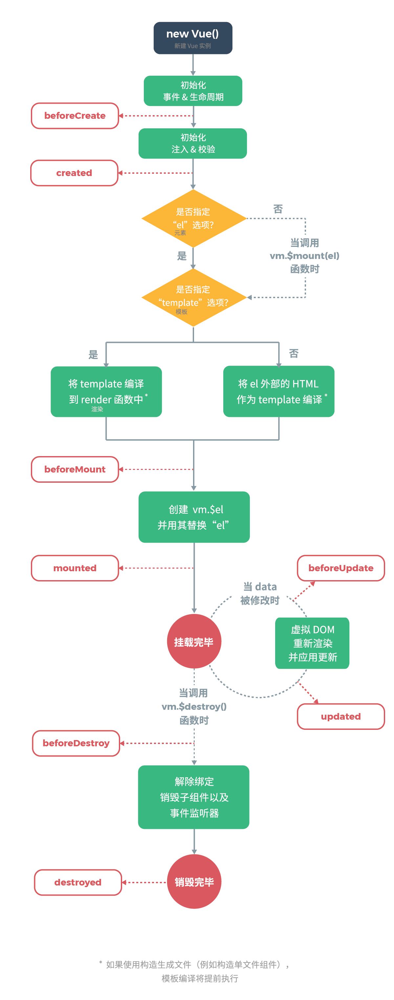

## Vue.js 是什么

[观看本节视频讲解](https://learning.dcloud.io/#/?vid=0)

## 起步

[观看本节视频讲解](https://learning.dcloud.io/#/?vid=1)

::: tip
您应当已了解关于 HTML、CSS 和 JavaScript 的中级知识。
:::

[安装](https://cn.vuejs.org/v2/guide/installation.html)

尝试 Vue.js 最简单的方法是使用 [JSFiddle 上的 Hello World 例子](https://jsfiddle.net/chrisvfritz/50wL7mdz/)。您可以在浏览器新标签页中打开它，跟着例子学习一些基础用法。或者您也可以创建一个 `.html` 文件，然后通过如下方式引入 Vue:

```html
<!-- 开发环境版本，包含了有帮助的命令行警告 -->
<script src="https://cdn.jsdelivr.net/npm/vue/dist/vue.js"></script>
```

或者:

```html
<!-- 生产环境版本，优化了尺寸和速度 -->
<script src="https://cdn.jsdelivr.net/npm/vue"></script>
```

::: warning
请注意 Mr.Hope **不推荐** 新手直接使用 `vue-cli`，尤其是在您还不熟悉基于 Node.js 的构建工具时。
:::

## 声明式渲染

[观看本节视频讲解](https://learning.dcloud.io/#/?vid=3)

Vue.js 的核心是一个允许采用简洁的模板语法来声明式地将数据渲染进 DOM 的系统:

```html
<div id="app">{{ message }}</div>
```

```js
const app = new Vue({
  el: "#app",
  data: {
    message: "Hello Vue!",
  },
});
```

我们已经成功创建了第一个 Vue 应用! 现在数据和 DOM 已经被建立了关联，所有东西都是**响应式的**。也就是说如果 `data` 中的 `message` 值被改变，那么视图层中的 `message` 马上会更新。

除了文本插值，我们还可以像这样来绑定元素特性:

```html
<div id="app-2">
  <span v-bind:title="message">
    鼠标悬停几秒钟查看此处动态绑定的提示信息!
  </span>
</div>
```

```js
const app2 = new Vue({
  el: "#app-2",
  data: {
    message: "页面加载于 " + new Date().toLocaleString(),
  },
});
```

这里我们遇到了一点新东西。您看到的 `v-bind` 特性被称为**指令**。指令带有前缀 `v-`，以表示它们是 Vue 提供的特殊特性。可能您已经猜到了，它们会在渲染的 DOM 上应用特殊的响应式行为。在这里，该指令的意思是: “将这个元素节点的 `title` 特性和 Vue 实例的 `message` 属性保持一致”。

## 条件与循环

[观看本节视频讲解](https://learning.dcloud.io/#/?vid=8)

控制切换一个元素是否显示也相当简单:

```html
<div id="app-3">
  <p v-if="seen">现在您看到我了</p>
</div>
```

```js
const app3 = new Vue({
  el: "#app-3",
  data: {
    seen: true,
  },
});
```

如果您改变 `seen` 的值，文字的显示与否(也就是 `<p>` 标签的存在与否)也会进行切换。

这个例子演示了我们不仅可以把数据绑定到 DOM 文本或特性，还可以绑定到 DOM **结构**。此外，Vue 也提供一个强大的过渡效果系统，可以在 Vue 插入/更新/移除元素时自动应用[过渡效果](https://cn.vuejs.org/v2/guide/transitions.html)。

还有其它很多指令，每个都有特殊的功能。例如，`v-for` 指令可以绑定数组的数据来渲染一个项目列表:

```html
<div id="app-4">
  <ol>
    <li v-for="todo in todos">{{ todo.text }}</li>
  </ol>
</div>
```

```js
const app4 = new Vue({
  el: "#app-4",
  data: {
    todos: [
      { text: "学习 JavaScript" },
      { text: "学习 Vue" },
      { text: "整个牛项目" },
    ],
  },
});
```

## 处理用户输入

[观看本节视频讲解](https://learning.dcloud.io/#/?vid=11)

为了让用户和您的应用进行交互，我们可以用 `v-on` 指令添加一个事件监听器，通过它调用在 Vue 实例中定义的方法:

```html
<div id="app-5">
  <p>{{ message }}</p>
  <button v-on:click="reverseMessage">反转消息</button>
</div>
```

```js
const app5 = new Vue({
  el: "#app-5",
  data: {
    message: "Hello Vue.js!",
  },
  methods: {
    reverseMessage: function () {
      this.message = this.message.split("").reverse().join("");
    },
  },
});
```

注意在 `reverseMessage` 方法中，每次点击按钮的时候，我们更新了应用的状态，但没有触碰 DOM——所有的 DOM 操作都由 Vue 来处理，您编写的代码只需要关注逻辑层面即可。

Vue 还提供了 `v-model` 指令，它能轻松实现表单输入和应用状态之间的双向绑定。

```html
<div id="app-6">
  <p>{{ message }}</p>
  <input v-model="message" />
</div>
```

```js
const app6 = new Vue({
  el: "#app-6",
  data: {
    message: "Hello Vue!",
  },
});
```

也就是说，在输入框做出的更改会同步到 js 的数据中。

## 组件化应用构建

[观看本节视频讲解](https://learning.dcloud.io/#/?vid=12)

组件系统是 Vue 的另一个重要概念，因为它是一种抽象，允许我们使用小型、独立和通常可复用的组件构建大型应用。仔细想想，几乎任意类型的应用界面都可以抽象为一个组件树:


在 Vue 里，一个组件本质上是一个拥有预定义选项的一个 Vue 实例。在 Vue 中注册组件很简单:

```js
// 定义名为 todo-item 的新组件
Vue.component("todo-item", {
  template: "<li>这是个待办项</li>",
});
```

现在您可以用它构建另一个组件模板:

```html
<ol>
  <!-- 创建一个 todo-item 组件的实例 -->
  <todo-item></todo-item>
</ol>
```

但是这样会为每个待办项渲染同样的文本，这看起来并不炫酷。我们应该能从父作用域将数据传到子组件才对。让我们来修改一下组件的定义，使之能够接受一个 [prop](https://cn.vuejs.org/v2/guide/components.html#通过-Prop-向子组件传递数据):

```js
Vue.component("todo-item", {
  // todo-item 组件现在接受一个
  // "prop"，类似于一个自定义特性。
  // 这个 prop 名为 todo。
  props: ["todo"],
  template: "<li>{{ todo.text }}</li>",
});
```

现在，我们可以使用 `v-bind` 指令将待办项传到循环输出的每个组件中:

```html
<div id="app-7">
  <ol>
    <!--
      现在我们为每个 todo-item 提供 todo 对象
      todo 对象是变量，即其内容可以是动态的。
      我们也需要为每个组件提供一个“key”，稍后再
      作详细解释。
    -->
    <todo-item
      v-for="item in groceryList"
      v-bind:todo="item"
      v-bind:key="item.id"
    ></todo-item>
  </ol>
</div>
```

```js
Vue.component("todo-item", {
  props: ["todo"],
  template: "<li>{{ todo.text }}</li>",
});

const app7 = new Vue({
  el: "#app-7",
  data: {
    groceryList: [
      { id: 0, text: "蔬菜" },
      { id: 1, text: "奶酪" },
      { id: 2, text: "随便其它什么人吃的东西" },
    ],
  },
});
```

尽管这只是一个刻意设计的例子，但是我们已经设法将应用分割成了两个更小的单元。子单元通过 prop 接口与父单元进行了良好的解耦。我们现在可以进一步改进 `<todo-item>` 组件，提供更为复杂的模板和逻辑，而不会影响到父单元。

在一个大型应用中，有必要将整个应用程序划分为组件，以使开发更易管理。在[后续教程](https://cn.vuejs.org/v2/guide/components.html)中我们将详述组件，不过这里有一个 (假想的) 例子，以展示使用了组件的应用模板是什么样的:

```html
<div id="app">
  <app-nav></app-nav>
  <app-view>
    <app-sidebar></app-sidebar>
    <app-content></app-content>
  </app-view>
</div>
```

### 与自定义元素的关系

您可能已经注意到 Vue 组件非常类似于**自定义元素**——它是 [Web 组件规范](https://www.w3.org/wiki/WebComponents/)的一部分，这是因为 Vue 的组件语法部分参考了该规范。例如 Vue 组件实现了 [Slot API](https://github.com/w3c/webcomponents/blob/gh-pages/proposals/Slots-Proposal.md) 与 `is` 特性。但是，还是有几个关键差别:

1. Web Components 规范已经完成并通过，但未被所有浏览器原生实现。目前 Safari 10.1+、Chrome 54+ 和 Firefox 63+ 原生支持 Web Components。相比之下，Vue 组件不需要任何 polyfill，并且在所有支持的浏览器 (IE9 及更高版本) 之下表现一致。必要时，Vue 组件也可以包装于原生自定义元素之内。

2. Vue 组件提供了纯自定义元素所不具备的一些重要功能，最突出的是跨组件数据流、自定义事件通信以及构建工具集成。

虽然 Vue 内部没有使用自定义元素，不过在应用使用自定义元素、或以自定义元素形式发布时，[依然有很好的互操作性](https://custom-elements-everywhere.com/#vue)。Vue CLI 也支持将 Vue 组件构建成为原生的自定义元素。

## 创建一个 Vue 实例

[观看本节视频讲解](https://learning.dcloud.io/#/?vid=2)

每个 Vue 应用都是通过用 `Vue` 函数创建一个新的 **Vue 实例**开始的:

```js
const vm = new Vue({
  // 选项
});
```

虽然没有完全遵循 [MVVM 模型](https://zh.wikipedia.org/wiki/MVVM)，但是 Vue 的设计也受到了它的启发。因此在文档中经常会使用 `vm` (ViewModel 的缩写) 这个变量名表示 Vue 实例。

当创建一个 Vue 实例时，您可以传入一个**选项对象**。这篇教程主要描述的就是如何使用这些选项来创建您想要的行为。作为参考，您也可以在 [API 文档](https://cn.vuejs.org/v2/api/) 中浏览完整的选项列表。

一个 Vue 应用由一个通过 `new Vue` 创建的**根 Vue 实例**，以及可选的嵌套的、可复用的组件树组成。举个例子，一个 todo 应用的组件树可以是这样的:

```md
根实例
└─ TodoList
├─ TodoItem
│ ├─ DeleteTodoButton
│ └─ EditTodoButton
└─ TodoListFooter
├─ ClearTodosButton
└─ TodoListStatistics
```

我们会在稍后的[组件系统](https://cn.vuejs.org/v2/guide/components.html)章节具体展开。不过现在，您只需要明白所有的 Vue 组件都是 Vue 实例，并且接受相同的选项对象 (一些根实例特有的选项除外)。

## 数据与方法

[观看本节视频讲解](https://learning.dcloud.io/#/?vid=3)

当一个 Vue 实例被创建时，它将 `data` 对象中的所有的属性加入到 Vue 的**响应式系统**中。当这些属性的值发生改变时，视图将会产生“响应”，即匹配更新为新的值。

```js
// 我们的数据对象
const data = { a: 1 };

// 该对象被加入到一个 Vue 实例中
const vm = new Vue({
  data: data,
});

// 获得这个实例上的属性
// 返回源数据中对应的字段
vm.a == data.a; // => true

// 设置属性也会影响到原始数据
vm.a = 2;
data.a; // => 2

// ……反之亦然
data.a = 3;
vm.a; // => 3
```

当这些数据改变时，视图会进行重渲染。值得注意的是只有当实例被创建时就已经存在于 `data` 中的属性才是**响应式**的。也就是说如果您添加一个新的属性，比如:

```js
vm.b = "hi";
```

那么对 `b` 的改动将不会触发任何视图的更新。如果您知道您会在晚些时候需要一个属性，但是一开始它为空或不存在，那么您仅需要设置一些初始值。比如:

```js
data: {
  newTodoText: '',
  visitCount: 0,
  hideCompletedTodos: false,
  todos: [],
  error: null
}
```

这里唯一的例外是使用 `Object.freeze()`，这会阻止修改现有的属性，也意味着响应系统无法再*追踪*变化。

```js
const obj = {
  foo: "bar",
};

Object.freeze(obj);

new Vue({
  el: "#app",
  data: obj,
});
```

```html
<div id="app">
  <p>{{ foo }}</p>
  <!-- 这里的 `foo` 不会更新!  -->
  <button v-on:click="foo = 'baz'">Change it</button>
</div>
```

除了数据属性，Vue 实例还暴露了一些有用的实例属性与方法。它们都有前缀 `$`，以便与用户定义的属性区分开来。例如:

```js
const data = { a: 1 };
const vm = new Vue({
  el: "#example",
  data: data,
});

vm.$data === data; // => true
vm.$el === document.getElementById("example"); // => true

// $watch 是一个实例方法
vm.$watch("a", function (newValue, oldValue) {
  // 这个回调将在 `vm.a` 改变后调用
});
```

以后您可以在 [API 参考](https://cn.vuejs.org/v2/api/#实例属性)中查阅到完整的实例属性和方法的列表。

## 实例生命周期钩子

[观看本节视频讲解](https://learning.dcloud.io/#/?vid=4)

每个 Vue 实例在被创建时都要经过一系列的初始化过程——例如，需要设置数据监听、编译模板、将实例挂载到 DOM 并在数据变化时更新 DOM 等。同时在这个过程中也会运行一些叫做**生命周期钩子**的函数，这给了用户在不同阶段添加自己的代码的机会。

比如 [`created`](https://cn.vuejs.org/v2/api/#created) 钩子可以用来在一个实例被创建之后执行代码:

```js
new Vue({
  data: {
    a: 1,
  },
  created: function () {
    // `this` 指向 vm 实例
    console.log("a is: " + this.a);
  },
});
// => "a is: 1"
```

也有一些其它的钩子，在实例生命周期的不同阶段被调用，如 [`mounted`](https://cn.vuejs.org/v2/api/#mounted)、[`updated`](https://cn.vuejs.org/v2/api/#updated) 和 [`destroyed`](https://cn.vuejs.org/v2/api/#destroyed)。生命周期钩子的 `this` 上下文指向调用它的 Vue 实例。

::: tip
不要在选项属性或回调上使用[箭头函数](https://developer.mozilla.org/zh-CN/docs/Web/JavaScript/Reference/Functions/Arrow_functions)，比如 `created: () => console.log(this.a)` 或 `vm.$watch('a', newValue => this.myMethod())`。因为箭头函数并没有 `this`，`this` 会作为变量一直向上级词法作用域查找，直至找到为止，经常导致 `Uncaught TypeError: Cannot read property of undefined` 或 `Uncaught TypeError: this.myMethod is not a function` 之类的错误。
:::

## 生命周期图示

下图展示了实例的生命周期。您不需要立马弄明白所有的东西，不过随着您的不断学习和使用，它的参考价值会越来越高。


