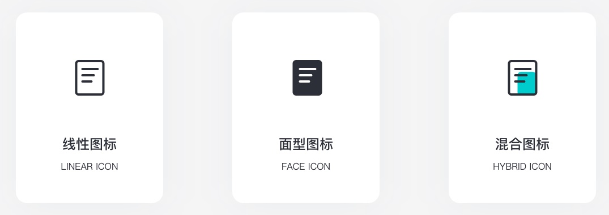
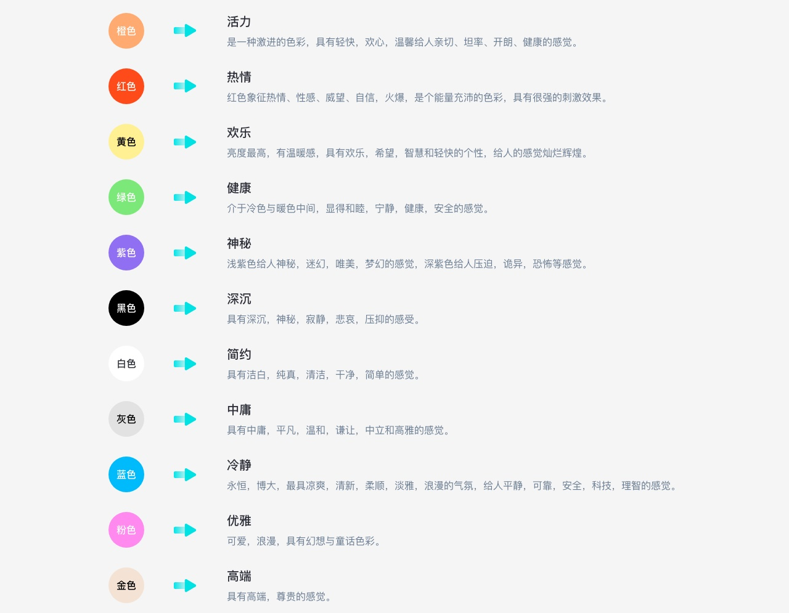
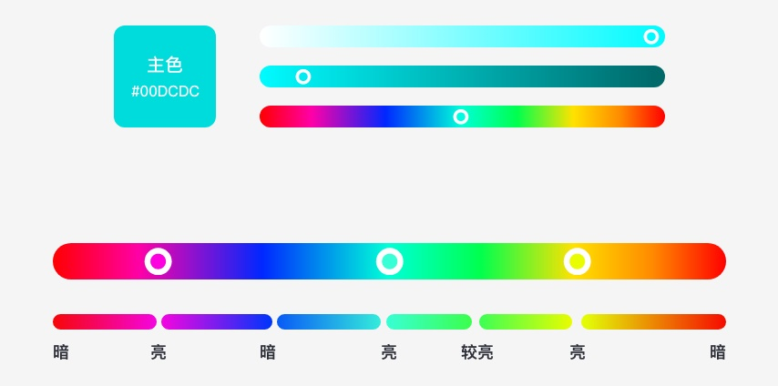
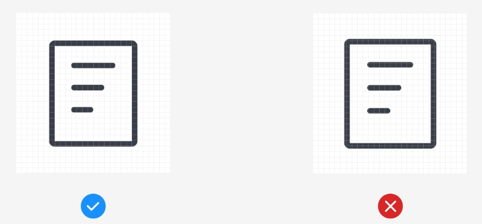
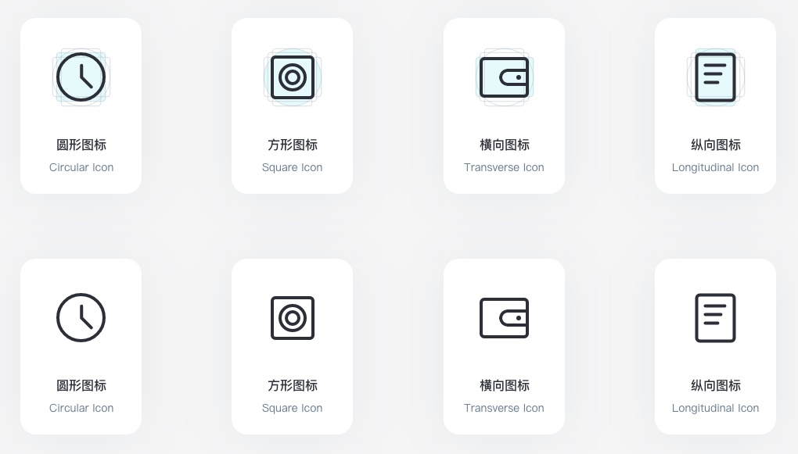
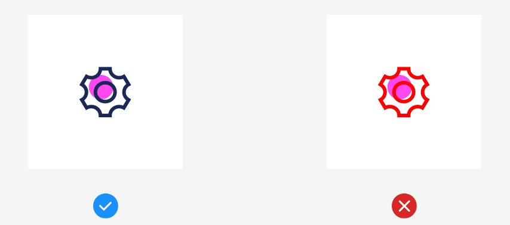
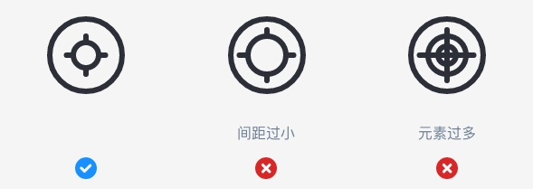
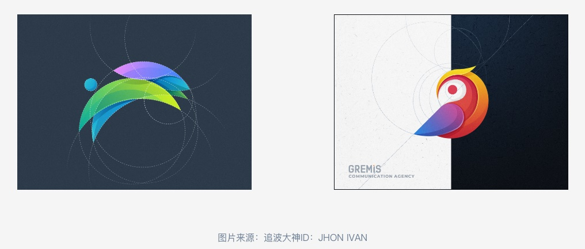
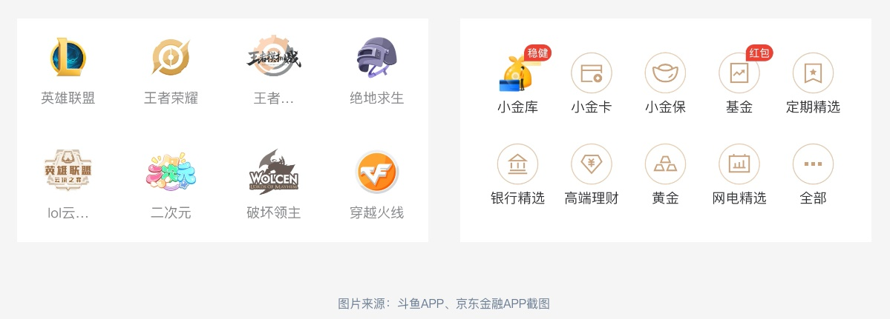

## 图标的可用性

图标可用性，顾名思义就是图标绘制出来是否能被用户所看懂并快速识别，是否可以为业务赋能。以下是总结的四条图标绘制的评判标准。

### 凸显性

用户是否能在某页面上迅速找到该图标，凸显性的目的是可以快速查找，帮助用户做选择。图标在识别的速度上远远大于文字，所以在一些页面中的重要功能使用图标的目的是为了吸引用户的注意力，让重要功能得到凸显，提高重要功能的点击率。

### 可识别性

图标的目的是要让用户猜出他看到的图标所表达的意义，有什么作用，以及点击后会出现什么样的场景，发生什么样的事情。所以一个图标的好与坏最重要的因素就体现在这里: 图标的可识别性与可预知性。

::: info 影响图标可识别性的三点因素

- 视觉复杂性: 图标的细节与组合图形的元素
- 熟悉性: 图标中图形所表达语义的熟悉程度
- 具体性: 图标或者图标中的图形与现实生活中物体的相似程度

:::

### 美观度

图标是否美观，对用户是否有足够的吸引力。在《设计通用法则》一书中有一条设计法则是: 美即适用效应。不管任何事物，美丽的外表都会给人带来好感，让人觉得这种事物在任何方面都非常美好。作为设计师，把一件事物美观化是一件终生的必修课，用户对图标或者界面的第一印象就是始于颜值。

### 业务属性

图标是否符合业务属性，是否可以唤起用户的使用情绪，提高点击率，起到为业务赋能的作用。在界面中图标最终目的不只是让用户觉得它美观，而是要为产品赋能，什么是为产品赋能呢? 通俗来说就是使图标能够提升点击率从而给公司创造收益。

### 图标如何为产品赋能

- 符合产品与业务属性: 比如儿童类产品，图标就要圆滑，多彩，看起来萌一点的感觉；如果是金融类的产品就应该使用微圆角，直角，中性色，金色来代表金融的庄严感与高级感。

- 唤起用户的使用情绪: 比如在大众点评 app 中，有关与食品的图标都使用橙色的拟物，因为暖色可以给人们带来食欲感，微拟物配合暖色系就可以唤起用户对食品的情绪感。

- 引导用户点击，提升点击率: 想要让用户点击一个内容，那必须要有足够的吸引力吸引用户去点击，一般来说美观度越高、趣味元素越多的图标可以占据大部分的吸引力，一个图标在页面中所占的比例也会影响对用户的吸引力，合理的文案搭配也会吸引用户去点击，比如优惠信息，新功能提示等。

## 图标类型选取

### 线性图标

线性图标，顾名思义，即图标是由直线、曲线、点在内等元素组合而成的图标样式。

#### 优点

线性图标辨识度高，清晰唯美，简约易看，不会对页面造成太多的视觉干扰。

#### 缺点是

线性图标的创作空间较少，太复杂的线性图标看起来会让人感觉到累。

### 面性图标

面性图标，即使用对图形内容进行色彩填充的图标样式。

#### 优点

面性图标是现实生活中物体的缩影，其表意能力强，细节丰富，色彩丰富，情绪感强，视觉突出，创作空间大等。面性图标可以让用户迅速定位图标位置，快速预知点击后的状态。

#### 缺点

面性图标在页面中不可过多出现，否则会造成页面臃肿，难分主次，用户视觉疲劳。

### 混合型图标

在设计图标类型的时候，不一定局限于单纯的线性与面性，也可以两者结合，让图标即有线性描边的轮廓，还有色彩填充的区域。

混合型图标可以让页面变得更加有活力，同时还可以吸引用户的注意力，美观与创意性强。

但是混合型图标在商业产品中要谨慎使用，因为使用不当会让页面变得杂乱不堪，用户无法识别图标表达的语义。

## 图标的色彩

### 色彩情绪

色彩情绪即颜色心理，指不同波长色彩的光信息作用于人的视觉器官，通过视觉神经传入大脑后，经过思维，与以往的记忆及经验产生联想，从而形成一系列的色彩心理反应。在任何场景下合理使用色彩心理可以调起用户情绪，还可以让用户产生联想进而快速识别。

在设计图标的时候，合理的运用色彩情绪，会使图标更具有科学性，可以让用户在使用的过程中更加自然、舒服，同时也会增加用户的识别速度唤起用户的使用情绪。

::: info 色彩情绪表

:::

### 配色方法

在配色时，应采用更具备科学性、更符合人类感官的 HSB 系统进行配置。在根据主色配置渐变色时，通常在主色的基础上加白或者加黑。但是只加入大量的白或者黑就会改变原本色彩的明度与饱和度，从而使画面显得雾蒙蒙的，不够清晰通透。正确的做法是在给主色变亮减暗的同时，改变主色的饱和度。在 hsb 色相条中，最亮的三个颜色分别是，蓝紫色，青绿色与黄色，如果需要加亮主色就在混白的同时将蓝色向青色改变色相，如果需要减暗则是相反，这样在调制渐变色变化的过程中不会出现太脏的颜色。

### 配色方案

#### 常见的色彩搭配

- 中性色(黑白) + 主色
- 主色 + 点缀色
- 主色 + 透明度
- 单渐变
- 双渐变错层
- 撞色叠加穿透等

一般常用的就是 中性色 + 主色、主色 + 点缀色。

#### 点缀色配色

- 互补色: 互补色就是在色环上距离 180° 的色彩，形成具有视觉冲击力的色彩。
- 近似色: 近似色是在色环上距离 45° 左右的色彩，形成的配色效果风格和谐统一。
- 对比色: 对比色是在色环上 120° 左右的色彩，可以产生较为强烈鲜明的视觉效果。

## 图标绘制技巧

### 像素对齐

在绘制图标的时候，应该将图标的每个像素尽量对齐于像素点，这样导出图标时像素的边缘不会出现锯齿，不会出现过于模糊的情况。通常在绘制时去除绘制软件中 x 与 y 轴，宽(w)与高(h)的小数点，这样就可以避免无法对齐像素的情况。

### 图标参考线

在绘制两个或者以上的图标时，为了避免多个图标出现大小不一的情况，应该使用由谷歌材料设计语言提供的图标参考线进行绘制，使用图标盒子可以让一整套图标在视觉效果上更加统一和谐，不会出现一大一小一长一短的情况。

#### 使用方法

先绘制一个 152×152px 的正方形，一个 176×176px 的正圆形，一个宽 176×128px 的水平矩形和一个 128×176px 的垂直矩形，圆角为 4px，然后将这个四个形状进行水平居中对齐，之后得出一个图标的参考线。

在宽度相等的情况下，正方形的面积要大于正圆的面积，所以在绘制圆形图标时应该将圆形的上下左右四个顶点顶齐与图标盒子正方形区域的四条边；在绘制方形图标时应该将方形的四个角点顶齐与圆形参考线的外围边；在绘制横向矩形与纵向矩形图标时，应该将图标的左右边或者是上下边控制在正方形的参考线之内，这样矩形图标绘制出来会更加的圆润，相对于其他的形状图标更加匹配。

### 可访问性

图标必须要保证清晰度，可辨别性。不管是在强光下还是正常光下都需要良好的可读性。这就需要图标不论是自身元素之间的对比度还是和页面底板背景之间的对比度都需要很好的可读性。检测图标的可读性通常要将图标的背景色底板在黑色和白色之间进行切换对比，不论是黑色还是白色的背景都可以看清图标的全部细节，还需要确保图标中的每一种颜色都是可见的。第二就是将图标拿到强光下进行观察，在强光下是否可以看清图标的主题结构，图标是否有足够的辨识度。

在绘制图标时，可以参考 WCAG 2.1: 图形和用户界面组件的对比度至少为 3 : 1 的标准进行相应配色，以达到良好的可视状态。

可访问性测试: <https://webaim.org/resources/contrastchecker/>

### 统一性

在绘制多个类型相同的图标时，需要注意这一套图标合集需要在视觉上保持统一性。在一整套产品中，会有很多种图标，但是图标的功能不一样，所表达的内容也不同。这时，图标一致性的意义就体现出来了，根据格式塔原理中的相似性原则: 人们会将如元素彼此相似的东西感知为一组。这也意味着如果具有相同功能、含义和层次结构级别的元素，则应在视觉上保持统一匹配。通常倾向于将彼此相似的元素视为同一个分组，相似性可以帮助组织和分类页面里的元素对象，并将它们与特定的含义或功能相关联。有不同的方法可以使元素被认为是相似的，这些方法包括颜色、大小、形状、纹理、尺寸和方向的相似性。

图标内容的统一会让用户明白相似的图标所代表的的功能也相同，而且在视觉上也更加和谐美观。因此在绘标后还需检查线条的粗细比重，边角的大小，配色方案，细节层次和设计元素在整个合集中是否是不变且一致的。

### 图标呼吸感

呼吸感的意思就是适当留白。在设计中，适当的留白可以突出主体内容，让内容具备易看性。不管是图标还是界面，元素与元素之间都应该存在一定的间距。在图标的绘制过程中，图标元素之间的间距不宜过近，元素也不宜过多。图标是一个物体的简略缩影，目的是为了表达内容，让用户快速理解，但是在有限的空间中，太过复杂的细节会影响图标的识别速度。因此在图标的绘制过程中应该删除所有无法传达图标意义的元素，避免使图标变得太过复杂难以识别。

### 合理运用布尔运算

布尔运算在设计行业中被得到广泛的运用，比如工业设计，影视后期，logo 设计等，布尔运算具有一致性与规范性的优点。在设计面性图标的时候可以合理使用布尔运算进行绘制，这样绘制的图标具有吸引力和说服力。

### 页面层次感

在页面中，有需要吸引用户点击的图标，也有起到辅助作用的指示图标，还有引导用户操作的图标，这些图标在页面中占据着不同的地位.在所有图标中，有色图标强于无色图标，多色图标强于单色图标，面性图标强于线性图标，带背景图标强于无背景图标，在设计图标的时候应该根据业务需要进行视觉强弱不同的设计。

### 业务属性

如文上所说，图标采用与业务相符合的色彩搭配会让用户在使用的过程中更加自然、舒服，同时也会增加用户的识别速度，唤起用户的使用情绪。一个图标的绘制是否具备商业价值也恰恰体现在这里。

如下图所示，左图是斗鱼直播 APP 的截图，右图是京东金融的图标截图。这两款产品的业务以及所对应的用户群体完全不一样，斗鱼是一款直播的产品，直播面向的用户群体是青少年，所以整体的产品调性是: 萌、活泼、多彩、绚丽、时尚等，斗鱼直播的图标绘制需要面向年轻人，色彩的高饱和与有趣的元素来抓住用户的眼球。但是京东金融是一款理财的产品，面向的用户则是中老年，大多数都是有一些存款的人，这些人不需要斗鱼那样花里胡哨的元素，他们只在乎这个产品是否安全，利息是否高，所以京东金融这个产品的整体风格就需要偏向于: 安全、高端、大气，这样才能给用户从视觉上营造信任感。设计图标时通常使用产品的调性作为主风格，但是像美团淘宝这些业务众多的产品中，就需要根据产品下的细分业务进行风格定位，然后设计中相应融入产品的品牌元素，使用合理的色彩情绪等让图标变得更符合业务的风格。

## 最终测试

使用前，还需要测试这一组图标的重心是否统一，常用的方法是使用标准的正圆形和正方形来和所有绘制的图标进行对比，保证所有的图标重心相近，视觉统一。也可以采用不同角度的观察法，可以从上下左右四个角度去观察图标，看看图标在不同的角度下重心是否统一。

