规范是图标设计的重点。

<!-- more -->

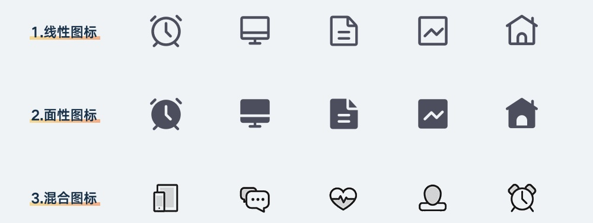

## 表意的准确

第一部分已经介绍了图标的主要作用之一就是作为文字的替代品，具有明确的寓意。比如看见一个放大镜，大家会当成那是搜索；看见钥匙或者锁，大家就会理解成是密码。

下面这些图标，每一个指代的功能和寓意都是非常直白和清晰的。

表达的寓意清晰，是图标最基本的要求，否则它只会传递错误的信息，造成用户的困惑。

在常见的图标类型里，如通知、设置、用户和分享之类的图标，对于任何手机用户来说都没有认知和选择压力。但表意准确麻烦的地方在于，一些非常规的寓意，极难用图标表现出来，这才是使用线性图标的首要麻烦。

比如下方这些图标，如果不加上文字信息，大家能理解它们是什么吗?

那么，再把文字信息补充进去，是不是就会觉得图形挺贴合内容的?

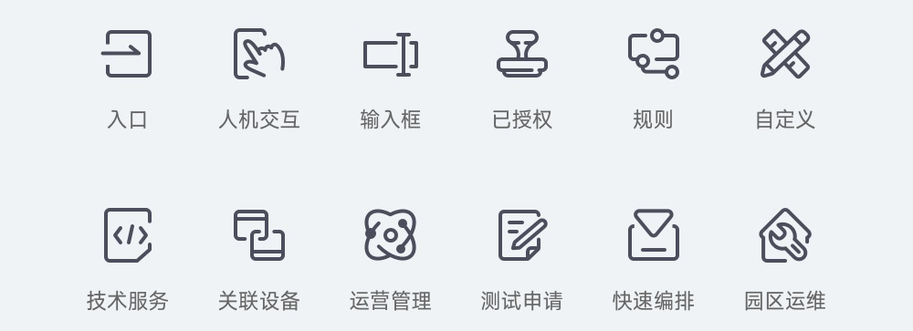

在这种案例中，需要要关注的就是，面对这样不常见的内容，设计师是怎么把图形的创意和样式想出来的，如果自己遇到一样的问题怎么办?

所以，除了知道每个图标都要表意准确之后，该如何通过合适的创意将图标样式确定出来?

一般抽象的图标，难点在于寓意信息是非实体的，很难直接构建对图形样式的联想，所以办法就是将抽象的内容「实体化」。也就是说，可以先把这个词写到纸上，把和这个抽象信息相关的所有实体物写下来。

之后可以挑选出某个合适的实物，以它作为原型开始绘制。如果对挑选出来的实物要以什么图形表现还没概念，那么就可以借助网上的图标素材网站，比如 iconfont、iconfinder 等，在搜索框中输入这些词语，通过别人的设计获取灵感。

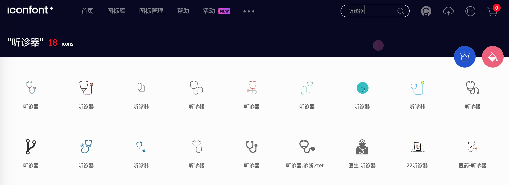

如果本身拥有比较好的手绘基础或是平面基础，也可以直接通过对照片进行提炼的方式，设计出图形内容。

所以，在设计图标时要符合表意准确的概念，需要设计师不断收集图形，并提升对词汇联想的能力。很多优秀的创意，就是在这些基础的积累之上逐渐形成的，而不是一蹴而就。

## 图标的一致性

第二个规范，叫图标的一致性。即一个或一套图标中，应该保持一致的细节。首先看看下面的反面案例:

在上面的案例中，不同图标间有很大的割裂感，完全不像处于同一套设计体系之下，这就是缺乏一致性的表现。这也是新手在设计一整套图标最大的难点，要让所有图标保持视觉细节上的一致。

那么，图标要保持视觉一致性有哪些细节呢?

### 类型一致

前面说过，图标有线性的和填充的类型，在正常的情况中，同一套图标应该保持相同的类型，如果使用了线性图标那么后续就不要设计填充以及混合的类型。

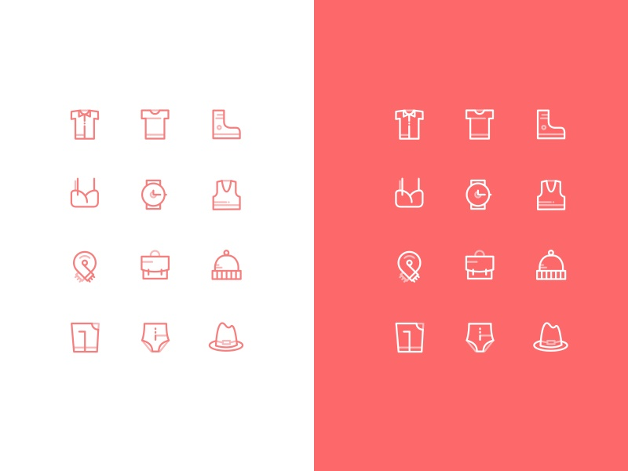

### 风格一致

每一套图标都有自己的设计风格，不同风格在细节中都有不同的表现，需要让这些风格特征保持高度统一，看看下面这些案例。

第一，为图标添加缺口的设计风格，不过要保证这个缺口的大小是一致的，并且每一个图标中有且只有一个缺口，而不是靠感觉随意添加。

第二，在设计一套偏圆润可爱的设计风格中，外轮廓使用了较大的圆角，那么应当尽可能保证圆角的大小是一致的，而不是有的用 4pt，有的用 2pt 或者直接使用直角。

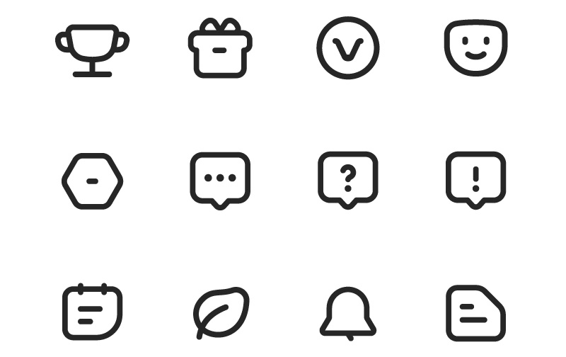

第三，采用了填充色偏移的设计风格，首先要保证填充色一致，并且偏移的距离和方向也要保持固定的规律，不能随喜好任意制定。

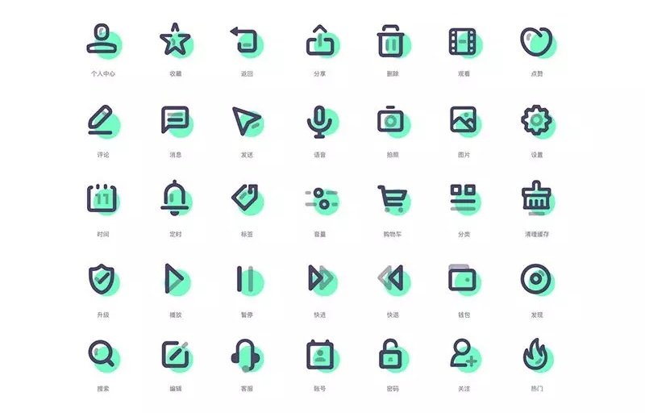

### 透视一致

透视关系是在平面中对物体空间性质的表现方式，当图标应用了透视时，物体就有了一定的「立体感」。

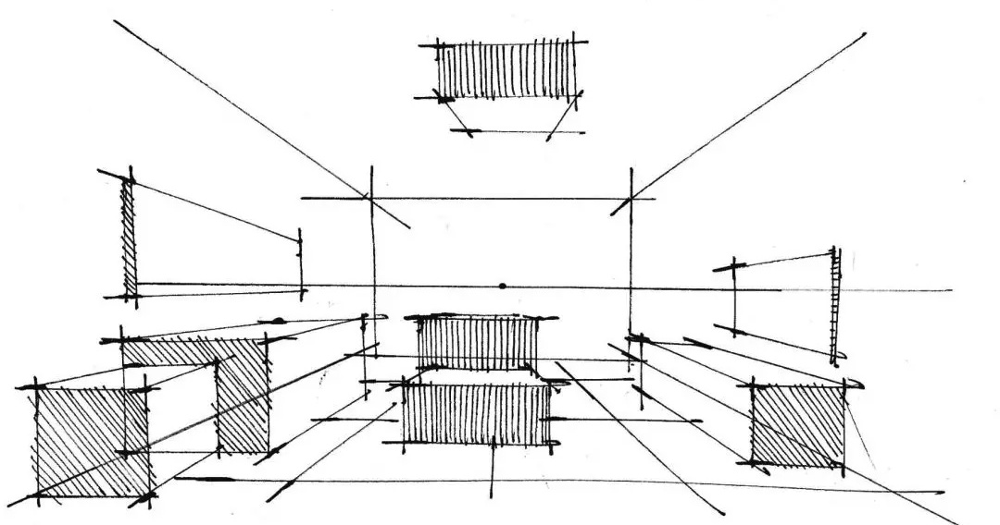

透视的表现不是绘制图标时必须使用的风格，但是如果在图标中应用了透视，就要确保使用的视角是一致的。要极力避免同一套图标中既用了正视图又包含了侧视图。

### 粗细一致

在图标中会常常应用到矩形线段或是描边，应尽可能保证粗细一致。

比如，在线性的设计中，路径的描边尺寸要保持一致，不能这个图标用 2pt，那个图标用 1pt。

在填充图标中，我们会在一个矩形或是圆形中增加矩形的镂空，比如下图的几个图标，在这种情况下也要保证它们的粗细是一致的，而不是各不相同。

### 大小一致

大小一致，就是让图标的视觉大小保持一致，而不是它们字面上的长宽属性保持一致。因为这是一个比较复杂的知识点，需要大家对几何图形的视觉差有比较完整的认识。这些和一致性有关的特征，是一套图标看起来专业、有整体感的必要条件。

但是，在真实的设计场景中需要灵活变通。如果有一些特定的图标，在保证了一致性的要求后却极难被人理解，且找不到更好的设计方式，就可以差别对待。比如在一套图标中，播放、快进等图标往往都是填充类型的，这并不会造成视觉或是使用上的困扰。

## 几何图形的视觉差

几何图形的视觉差，是对于图标来说最重要的细节，也是平面基础理论中不可忽视的内容，这个理论要解决一个核心的问题，即怎么让不同的图形看上去一样大?

可能大家有人会觉得这有什么难的? 通过软件的参考线或者属性设置，把它们的长宽设置成一样不就完事了。比如下图这样:

画起来轻轻松松，参数上完美无缺。但是，怎么看上去这些图形大小有点不一样，为什么正方形看起来这么大，三角形看起来这么小?

这个问题的根源是，不同几何图形带给人们的视觉大小是不同的。而要解决这样的问题，就要对它们的尺寸做出额外的调整。比如下图这样:

适当调整完圆形和三角形以后，是不是觉得大小的感觉一致了? 这就要牵扯一个更基础的视觉规律，占据面积越大的图形，给人的视觉感受就越大，所以给人感受越小的元素，就要放得越大。

并且，这个问题在一个图形的内部也会产生影响，比如知乎 APP 下面的点赞和反对按钮，都有三角形图标，但图形其实对于外部矩形是非居中的。

如果一个图形其中一部分面积远大于另一部分，那么就会让这个图形的重心产生偏移，必须要往较小的部分的方向移动才能产生平衡。

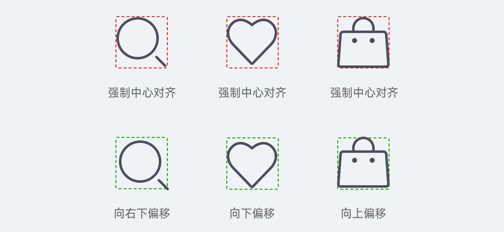

所以，在设计一整套的应用中，如果没有对这个理论的理解，只定义一个矩形出来，把所有图形的尺寸与矩形对齐，那么最终看到的图标效果一定是极度不平衡的。

## 图标栅格

其实，针对图标的规范，大家可能第一个想到的应该就是参考线了，也就是所谓的栅格模板。之所以放在这里，是因为图标的栅格规范，是根据几何的视觉差特性衍生出来的。

下面是常见的图标栅格:

里面包含了正方形、长方形和圆形。将它们分别罗列出来，可以发现这些图形的视觉尺寸是非常接近的。这样通过该尺寸设计对应的图形，也就看起来都一样大了。

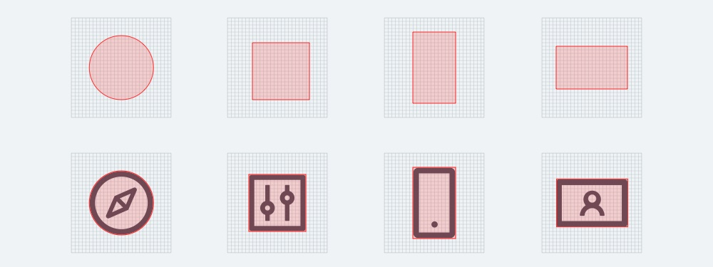

所以，应用图标的栅格系统对于图标的设计来说，是一个用来应对几何图形视觉差的「参照物」。

之所以要说参照物，原因在于一套图标不会只存在这几种图形的样式，还有很多千奇百怪的形状，但大体上我们可以识别出来它的类似轮廓或者重心方向，于是就可以通过参照图形来判断设计出来的图形尺寸是否符合标准。

如果设计图形和参照图形类似，那么尺寸就不能大于参照图形；如果设计图形的宽大于参照图，那么高就要小于参照图，反之亦然。如果图形的重心有偏移，那就要往重心偏移的反方向移动，比如搜索按钮，Wifi 图标等。

最后，说说栅格系统的画法，和大家想象的不一样，想要画一套图标，栅格系统是自己画出来的，不是到网上下载下来的，所以怎么画也是这个知识的重点。

1. 如何绘制图标栅格系统

如果定义一套 28pt 的图标，那么首先要画一个 28pt 的正方形，然后确定一个 2 - 4pt 的内边距，正所谓四边留一线，日后好相见。

然后就要开始在其中绘制正方形和圆形，正方形通常在整个图标尺寸 1/2 的比例，可以使用 14 或 16 的偶数(为了可以居中)。然后再确定圆形的尺寸，圆肯定比正方形大 2 - 4pt，于是就得到下方的图形。

之后，再确定横竖长方形的尺寸，可以直接顶到内边距的边缘。它的尺寸不是通过数值计算的，而是要先画出来，把它们和前面的圆和正方形置于一条水平线上，调整出一个平衡的视觉尺寸，再合并进栅格系统中，就完成了栅格系统的绘制，如下图的案例。

这一步也旨在检查参考线系统是否在基础结构上经得起考验，是非常关键的一步。因为不同尺寸的图标中，参考线系统都是有区别的，不能直接按一个固定的比例来设置，要根据实际场景做判断。

::: info 栅格素材

此处有一套现成的栅格素材，包含 16、24、28、32、36、48 等六个尺寸。

- [工具栅格下载](/file/design/tool-grid.ai)

:::

## 像素对齐

在栅格的绘制中，如果您足够信心，您肯定发现了几个关键字，「对齐」、「偶数」，这就是在这一部分要提及的内容。关于显示器的倍率问题是 UI 基础知识点之一，可能有的同学不太了解，不过没关系，直接看下面的内容即可。

大家都知道像素是屏幕显示中的最小单位，一个像素只能显示一种颜色。小时候玩过的 GBA 和 FC 游戏机，都是通过像素画的形式呈现，人物锯齿是无法避免的。

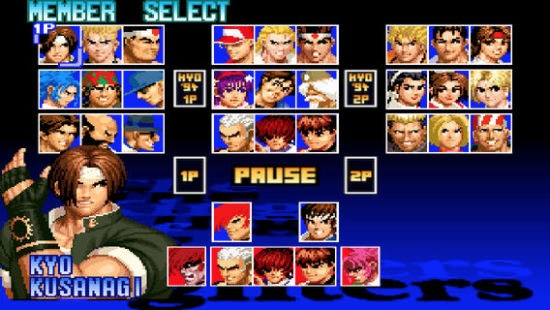

而随着技术发展，像素密度是降低了，但如果依旧是按过去这种一个萝卜一个坑的方式显示内容，那锯齿感无论如何是无法消除的。于是，开发了次像素渲染(Subpixel Rendering)的技术。一个在显示器中让人们觉得平滑的圆，一直放大，就可以发现它的周边充满了饱和度较低的其它方块色彩。

这项技术，让像素可以用特有的方式来显示非完整的色块，即尽可能还原设计师对元素定义的小数点。但为什么还要提这个概念呢?

因为工具的图标太小了，而且 UI 的元素对精细和准确度的要求都不低，如果没有尽可能满足像素对齐的要求，那么就可能导致元素边缘的模糊。

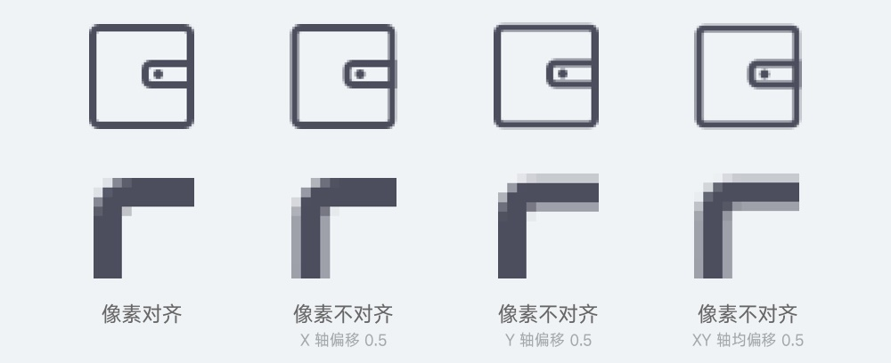

所以要满足像素对齐的要求，就要符合元素本身的尺寸为整数、描边为整数和 XY 轴坐标为整数的特性。

### AI 中的像素对齐设置

在 AI 中，可以通过两个设定来查看和保证像素对齐，即网格的设置显示，以及对齐到点的设置。

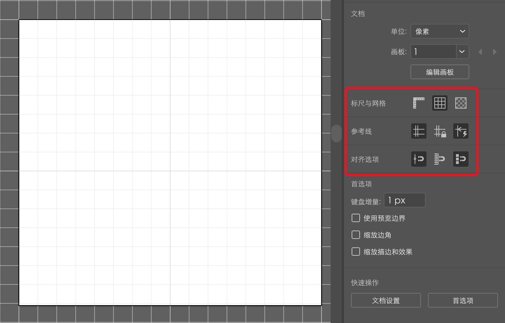

像素的对齐主要表现在横线和竖线上，虽然现在手机显示精度越来越高，但并不意味着可以无视像素对齐的规律。在线性图标中，对于 1pt 或者 2pt 描边的应用，觉得不是太细就是太粗，可以用 1.5pt 的数值(1.5pt 在 2x 中就是 3px)，但切记不要出现类似 1.23、2.16、3.46 这种小数。

像素对齐是一个专业 UI 设计师对于极致追求的表现之一，是每一个一线大厂 UI 设计师的基本操作，所以，想要冲刺更高的段位，就不要忽视这个规范的使用。

## 总结

- 图标要表意准确，能被用户识别并契合想要表达的寓意。

- 设计整套图标的时候要符合一致性原则，包括类型、风格、粗细、透视、大小等特征。

- 不同的几何图形会给我们不同的大小视感，不能只看元素的参数。

- 栅格系统根据视觉差的方式定义出来，作为图标尺寸设定的重要参考。

- 图标的绘制要保证横竖的直线对齐到像素，图标尽量采用整数粗细，如果一定要用小数的话就使用 0.5 递进的。
