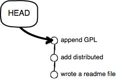

修改 readme.txt 文件如下:

```md
Git is a distributed version control system.
Git is free software distributed under the GPL.
```

然后尝试提交:

```sh
$ git add readme.txt
# nothing displayed
$ git commit -m "append GPL"
[master 1094adb] append GPL
 1 file changed, 1 insertion(+), 1 deletion(-)
```

像这样不断对文件进行修改，然后不断提交修改到版本库里，每当文件修改到一定程度的时候，就可以“保存一个快照”，这个快照在 Git 中被称为 `commit`。如果把文件改乱了，或者误删了文件，还可以从最近的一个 `commit` 恢复，然后继续工作，而不是把几个月的工作成果全部丢失。

现在，我们回顾一下 `readme.txt` 文件一共有几个版本被提交到 Git 仓库里了:

- 版本 1: wrote a readme file

```md
Git is a version control system.
Git is free software.
```

- 版本 2: add distributed

```md
Git is a distributed version control system.
Git is free software.
```

- 版本 3: append GPL

```md
Git is a distributed version control system.
Git is free software distributed under the GPL.
```

## 查看版本信息

版本控制系统用 `git log` 命令可以告诉我们历史记录，在 Git 中，我们查看:

```sh
$ git log
commit 1094adb7b9b3807259d8cb349e7df1d4d6477073 (HEAD -> master)
Author: Michael Liao <askxuefeng@gmail.com>
Date:   Fri May 18 21:06:15 2018 +0800

    append GPL

commit e475afc93c209a690c39c13a46716e8fa000c366
Author: Michael Liao <askxuefeng@gmail.com>
Date:   Fri May 18 21:03:36 2018 +0800

    add distributed

commit eaadf4e385e865d25c48e7ca9c8395c3f7dfaef0
Author: Michael Liao <askxuefeng@gmail.com>
Date:   Fri May 18 20:59:18 2018 +0800

    wrote a readme file
```

`git log` 命令显示从最近到最远的提交日志，我们可以看到 3 次提交，最近的一次是 `append GPL`，上一次是 `add distributed`，最早的一次是 `wrote a readme file`。

如果嫌输出信息太多，看得眼花缭乱的，可以试试加上 `--pretty=oneline` 参数:

```sh
$ git log --pretty=oneline
1094adb7b9b3807259d8cb349e7df1d4d6477073 (HEAD -> master) append GPL
e475afc93c209a690c39c13a46716e8fa000c366 add distributed
eaadf4e385e865d25c48e7ca9c8395c3f7dfaef0 wrote a readme file
```

一大串类似 `1094adb...` 的是 `commit id` (版本号)，和 SVN 不一样，Git 的 commit id 不是 1，2，3…… 递增的数字，而是一个 SHA1 计算出来的一个非常大的数字，用十六进制表示，为什么 commit id 需要用这么一大串数字表示呢? 因为 Git 是分布式的版本控制系统，多人在同一个版本库里工作，如果大家都用 1，2，3…… 作为版本号，那肯定就冲突了。

每提交一个新版本，实际上 Git 就会把它们自动串成一条时间线。如果使用可视化工具查看 Git 历史，就可以更清楚地看到提交历史的时间线:


::: tip 更多选项
关于 `git log` 的更多选项，请见 [ProGit 书籍](/file/git/progit_v2.1.45.pdf) 的 P43。
:::

## 回退版本

好了，现在准备把 readme.txt 回退到上一个版本，也就是 `add distributed` 的那个版本，怎么做呢?

首先，Git 必须知道当前版本是哪个版本，在 Git 中，用`HEAD`表示当前版本，也就是最新的提交 `1094adb...` (注意我的提交 ID 和您的肯定不一样)，上一个版本就是 `HEAD^`，上上一个版本就是 `HEAD^^`，当然往上 100 个版本写 100 个 `^` 比较容易数不过来，所以写成 `HEAD~100`。

现在，要把当前版本 `append GPL` 回退到上一个版本 `add distributed`，就可以使用 `git reset` 命令:

```sh
$ git reset --hard HEAD^
HEAD is now at e475afc add distributed
```

看看 readme.txt 的内容是不是版本 add distributed:

```sh
$ cat readme.txt
Git is a distributed version control system.
Git is free software.
```

果然被还原了。

还可以继续回退到上一个版本 wrote a readme file，不过且慢，然我们用 `git log` 再看看现在版本库的状态:

```sh
$ git log
commit e475afc93c209a690c39c13a46716e8fa000c366 (HEAD -> master)
Author: Michael Liao <askxuefeng@gmail.com>
Date:   Fri May 18 21:03:36 2018 +0800

    add distributed

commit eaadf4e385e865d25c48e7ca9c8395c3f7dfaef0
Author: Michael Liao <askxuefeng@gmail.com>
Date:   Fri May 18 20:59:18 2018 +0800

    wrote a readme file
```

最新的那个版本 append GPL 已经看不到了! 肿么办?

办法其实还是有的，只要上面的命令行窗口还没有被关掉，您就可以顺着往上找啊找啊，找到那个 append GPL 的 commit id 是 1094adb...，于是就可以指定回到未来的某个版本:

```sh
$ git reset --hard 1094a
HEAD is now at 83b0afe append GPL
```

版本号没必要写全，前几位就可以了，Git 会自动去找。当然也不能只写前一两位，因为 Git 可能会找到多个版本号，就无法确定是哪一个了。

再小心翼翼地看看 readme.txt 的内容:

```sh
$ cat readme.txt
Git is a distributed version control system.
Git is free software distributed under the GPL.
```

果然，我胡汉三又回来了。

Git 的版本回退速度非常快，因为 Git 在内部有个指向当前版本的 `HEAD` 指针，当您回退版本的时候，Git 仅仅是把 `HEAD` 从指向 append GPL:



改为指向 `add distributed`:


然后顺便把工作区的文件更新了。所以您让 `HEAD` 指向哪个版本号，您就把当前版本定位在哪。

## 找回 commit id

如果回退到了某个版本找不到新版本的 `commit id`，在 Git 中，就无法用 `$ git reset --hard HEAD^` 回退。

所以 Git 提供了一个命令 `git reflog` 用来记录您的每一次命令:

```sh
$ git reflog
e475afc HEAD@{1}: reset: moving to HEAD^
1094adb (HEAD -> master) HEAD@{2}: commit: append GPL
e475afc HEAD@{3}: commit: add distributed
eaadf4e HEAD@{4}: commit (initial): wrote a readme file
```

```sh
$ git reflog
e475afc HEAD@{1}: reset: moving to HEAD^
1094adb (HEAD -> master) HEAD@{2}: commit: append GPL
e475afc HEAD@{3}: commit: add distributed
eaadf4e HEAD@{4}: commit (initial): wrote a readme file
```

终于舒了口气，从输出可知，append GPL 的 commit id 是 1094adb，现在，您又可以乘坐时光机回到未来了。

## 小结

- `HEAD` 指向的版本就是当前版本，因此，Git 允许我们在版本的历史之间穿梭，使用命令 `git reset --hard commit_id`。

- 用 `git log` 可以查看提交历史，以便确定要回退到哪个版本。

- 用 `git reflog` 查看命令历史，以便确定要回到未来的哪个版本。
