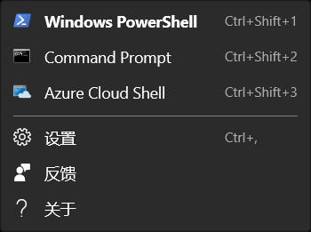
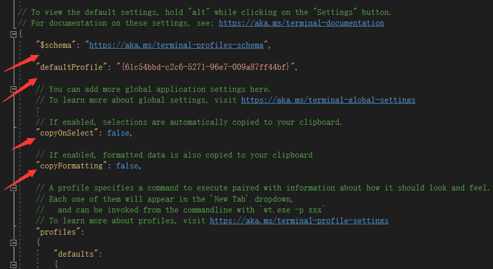
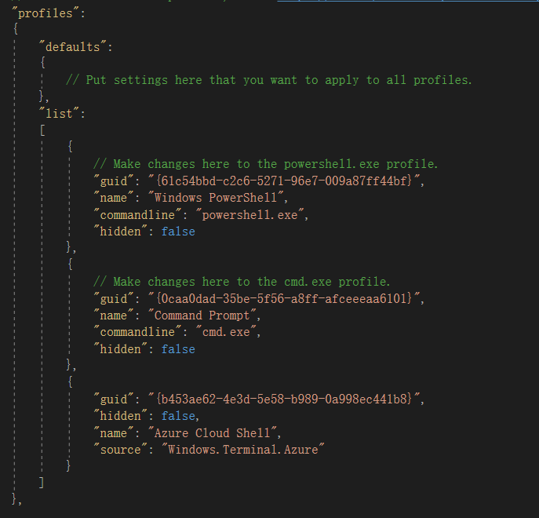
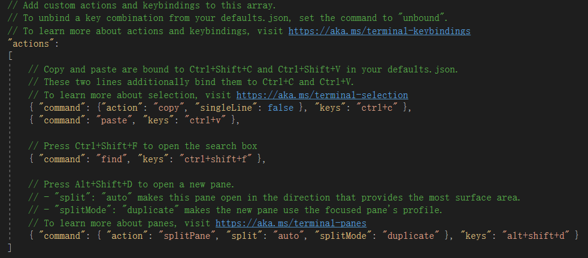
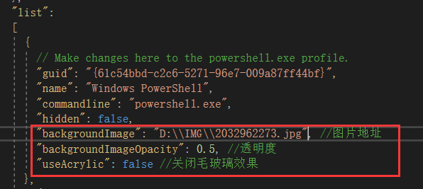
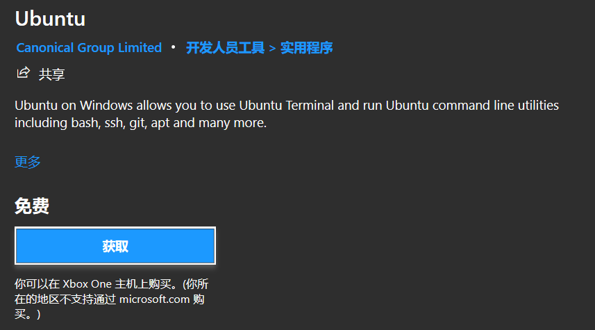

 
## 安装

您可以 [直接下载 exe](https://github.com/microsoft/terminal/releases/tag/v1.4.3243.0) 进行安装，或从Microsoft官网 [进行安装](https://www.microsoft.com/zh-cn/p/windows-terminal/9n0dx20hk701?rtc=1&activetab=pivot:overviewtab)，同样您可以在Microsoft应用商店直接搜索下载。

另外您也可通过[下载预览版](https://github.com/microsoft/terminal/releases/tag/v1.4.3243.0)体验最新功能。

::: info 系统要求
|          | 最低要求                           | 推荐要求                           |
| -------- | ---------------------------------- | ---------------------------------- |
| 操作系统 | Windows 10 版本 18362.0 或更高版本 | Windows 10 版本 18362.0 或更高版本 |
| 体系结构 | ARM64、x64、x86                    | ARM64、x64、x86                    |
| 键盘     | 未指定                             | 集成键盘                           |
| 注意     | 未指定                             | 键盘                               |
|          |

:::

## 优点

- 主题可自定义
- 免费开放源代码
- 扩展性超强
- 支持连接众多平台

## 功能

Terminal的主要功能：

- 多标签支持
- 优化的字体
- 设置和可配置性
- 连接多平台

## 首次启动

Windows Terminal 安装完成后，您可以启动它，并开启命令行界面。默认情况下，Windows Terminal 的下拉菜单中包含 Windows PowerShell、Command Prompt 和 Azure Cloud Shell 配置文件。如果您的计算机上安装了 Windows Subsystem for Linux (WSL) 分发版，则在首次启动 Windows Terminal 时，它们也会作为配置文件动态加载。




如图所示，可以使用快捷键Ctrl+Shift+*来打开对应的配置文件，可使用Ctrl+，打开 settings.json 文件，来进行个性化调整和默认设置更改等设置。

## 配置文件

配置文件代表着您可以在 Windows Terminal 中配置的不同的命令行环境。默认情况下，每个配置文件使用不同的命令行可执行程序，但是您可以根据自己的喜好，创建任意数量的使用同一可执行程序的配置文件。每个配置文件可以有自己的定制项以帮助您区分它们，并且可以为每个配置文件添加您特有的个性。

默认配置文件为Windows PowerShell。您可以通过在 settings.json 文件中将 "defaultProfile" 设置为首选配置文件的名称来更改默认配置文件。

```shell
"defaultProfile": "PowerShell"
```

## 新增一个配置文件

可以通过 Windows 终端或者手动动态地添加新的配置文件。Windows Terminal 会自动为 PowerShell 和 WSL 分发版创建配置文件。这些配置文件具有一个 "source" 属性，告诉 Windows 终端在哪里可以找到合适的可执行程序。

如果您想要手动创建新的配置文件，您只需生成一个新的 "guid"，提供一个 "name"，并为 "commandline" 属性提供可执行程序。

 注意：您不能从动态生成的配置文件中复制 "source" 属性，否则 Windows 终端会忽略此配置文件。您必须使用 "commandline" 替换 "source" 并提供可执行程序，以便复制一个动态生成的配置文件。

 

## Settings.json 结构

 Windows Terminal 中包含两个设置文件。一个是 defaults.json，可以通过按住 Alt 键并点击下拉菜单中的 Settings 按钮打开，这是一个不可更改的文件，其中包含 Windows Terminal 的所有默认设置。另一个是 settings.json，可以通过点击下拉菜单中的 Settings 按钮访问，您可以在其中应用所有的自定义设置。

settings.json 文件分为四个主要部分。第一部分是全局设置对象，它位于 JSON 文件的顶部，在第一个 {  内，此处的设置影响整个应用程序。



继续往下看，下一个主要部分是配置文件（"profiles"）对象，"profiles" 对象分为两个部分："defaults" 和 "list"。您可以将配置文件设置应用于 "defaults" 对象，这些设置将应用到 "list" 中的所有配置文件。"list" 包含代表上述配置文件的每个配置文件对象，这些是出现在 Windows 终端下拉菜单中的项目。应用于 "list" 中各个配置文件的设置会覆盖 "defaults" 部分中应用的设置。



文件再往下是 "schemes" 数组，这里可以放置自定义配色方案。一个可以帮您生成自己的配色方案的好工具是 terminal.sexy。


最后，在文件底部，放置 "actions" 数组。这里列出的对象会将操作添加到 Windows 终端，可以通过键盘调用和（或）在命令面板中找到。



### 主题色

下面提供几个主题色选择方式：

- 进入该网站[https://atomcorp.github.io/themes/]，选择一个你喜欢的主题复制主题代码，在settings.json 文件中更改
- 进入该网站[https://terminalsplash.com/]，选择一个你喜欢的主题复制主题代码，在settings.json 文件中更改

### 背景设置

在如图位置添加下列代码来更改背景图片，不同配置文件可以使用不同的背景图，需要分别更改。图片位置自行设置，各种参数修改可以自行查询更改方式。

```shell
"backgroundImage": "C://IMG//1.jpg",  //图片地址
"backgroundImageOpacity" : 0.5,    //透明度
"useAcrylic":false            //关闭毛玻璃效果
```



## 支持Ubantu

你可以直接在Microsoft应用商店搜索并下载Ubantu，这里的Ubantu指的是系统内置的Ubuntu运行环境。之后便可以在terminal上运行。


