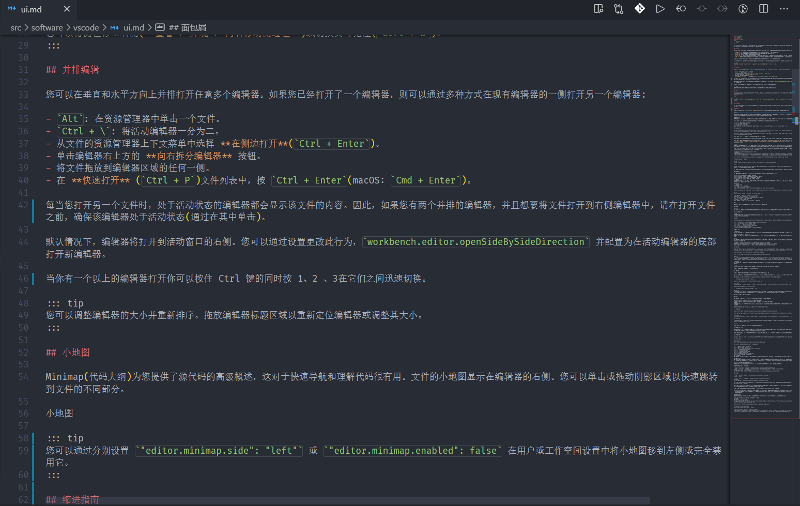
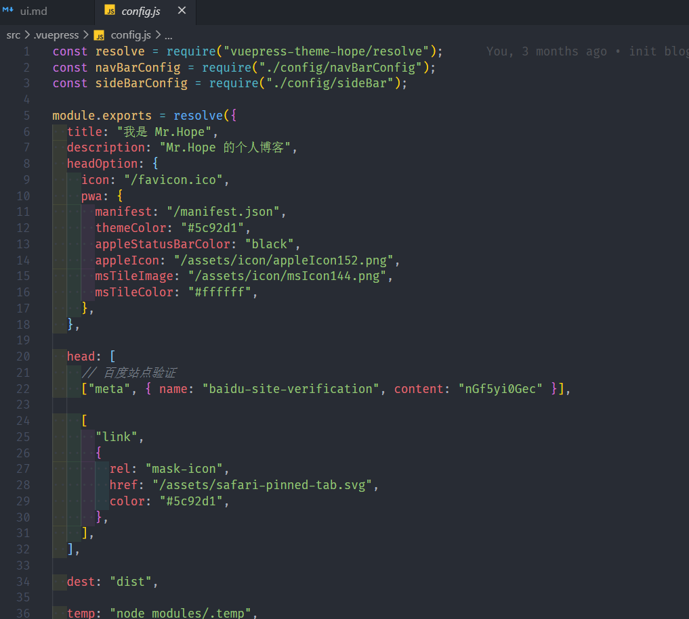
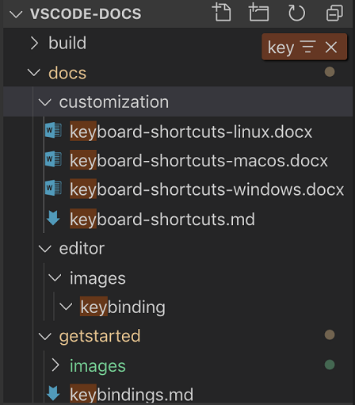
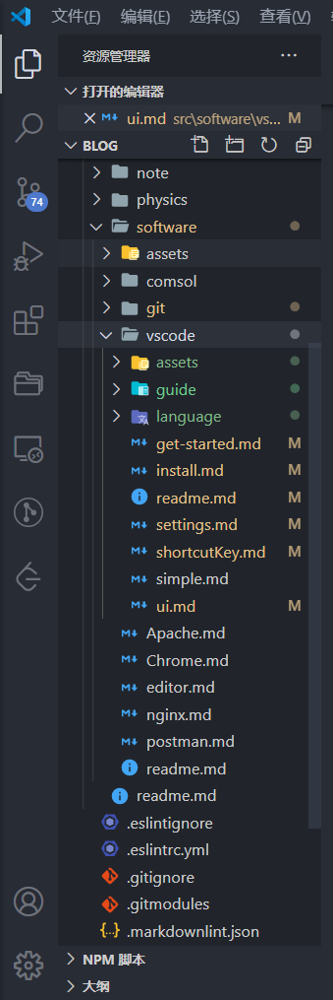
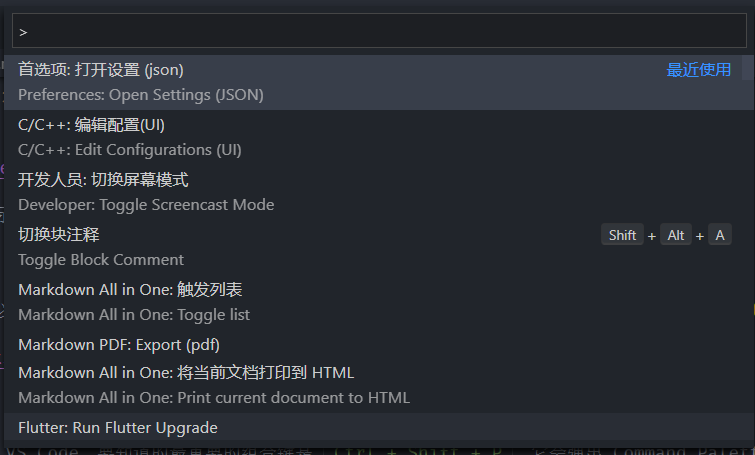
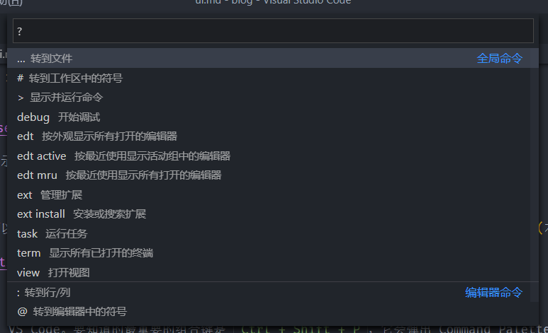

本质上，Visual Studio Code 是代码编辑器。像许多其他代码编辑器一样，VS Code 在左边采用通用的用户界面和资源管理器布局，以显示您有权访问的所有文件和文件夹，而在右边的编辑器则显示您已打开文件的内容。

## 基本布局

VS Code 具有简单直观的布局，可最大程度地为编辑器提供空间，同时为浏览和访问文件夹或项目的整个上下文留出足够的空间。用户界面分为五个区域:

- **编辑器**: 用于编辑文件的主要区域。您可以在垂直和水平方向上并排打开任意多个编辑器。
- **侧边栏**: 包含诸如资源管理器之类的不同视图，可在您处理项目时为您提供帮助。
- **状态栏**: 有关打开的项目和您编辑的文件的信息。
- **任务栏**: 位于最左侧，可让您在视图之间进行切换，并为您提供特定于上下文的其他指示符，例如启用 Git 时传出更改的数量。
- **面板**: 您可以在编辑器区域下方显示不同的面板，以获取输出或调试信息，错误和警告或集成终端。面板也可以向右移动以获得更多垂直空间。

每次启动 VS Code 时，它的打开状态与上次关闭时的状态相同。文件夹，布局和打开的文件将保留。

在每个编辑器中打开的文件都显示在编辑器区域顶部，带有选项卡式标题(Tab)。要了解有关选项卡式标题的更多信息，请参见下面的 [选项卡](#选项卡) 部分。

::: tip
您可以将侧栏移至右侧(**查看 > 外观 > 向右移动侧边栏**)或切换其可见性(`Ctrl + B`)。
:::

## 并排编辑

您可以在垂直和水平方向上并排打开任意多个编辑器。如果您已经打开了一个编辑器，则可以通过多种方式在现有编辑器的一侧打开另一个编辑器:

- `Alt`: 在资源管理器中单击一个文件。
- `Ctrl + \`: 将活动编辑器一分为二。
- 从文件的资源管理器上下文菜单中选择 **在侧边打开**(`Ctrl + Enter`)。
- 单击编辑器右上方的 **向右拆分编辑器** 按钮。
- 将文件拖放到编辑器区域的任何一侧。
- 在 **快速打开** (`Ctrl + P`)文件列表中，按 `Ctrl + Enter`(macOS: `Cmd + Enter`)。

每当您打开另一个文件时，处于活动状态的编辑器都会显示该文件的内容。因此，如果您有两个并排的编辑器，并且想要将文件打开到右侧编辑器中，请在打开文件之前，确保该编辑器处于活动状态(通过在其中单击)。

默认情况下，编辑器将打开到活动窗口的右侧。您可以通过设置更改此行为，`workbench.editor.openSideBySideDirection` 并配置为在活动编辑器的底部打开新编辑器。

当你有一个以上的编辑器打开你可以按住 Ctrl 键的同时按 1、2、3 在它们之间迅速切换。

::: tip
您可以调整编辑器的大小并重新排序。拖放编辑器标题区域以重新定位编辑器或调整其大小。
:::

## 小地图

Minimap(代码大纲)为您提供了源代码的高级概述，这对于快速导航和理解代码很有用。文件的小地图显示在编辑器的右侧。您可以单击或拖动阴影区域以快速跳转到文件的不同部分。



::: tip
您可以通过分别设置 `"editor.minimap.side": "left"` 或 `"editor.minimap.enabled": false` 在用户或工作空间设置中将小地图移到左侧或完全禁用它。
:::

### 缩进指南



上图还显示了压痕指南(垂直线)，可帮助您快速查看匹配的压痕级别。如果您要禁用缩进指南，则可以 `"editor.renderIndentGuides": false` 在用户或工作空间设置中进行设置。

::: tip
请安装 **Bracket Pair Colorizer 2** 扩展来启用彩虹缩进
:::

## 导航痕迹

编辑器在其内容上方有一个导航栏，称为 **导航痕迹**。它显示当前位置，并允许您在文件夹，文件和符号之间快速导航。


导航痕迹始终显示文件路径，如果当前文件类型支持符号的语言，则符号路径直至光标位置。您可以使用 **查看 > 显示导航痕迹** 切换命令禁用导航痕迹。有关导航痕迹功能的更多信息，例如如何自定义其外观，请参见 [导航痕迹](https://code.visualstudio.com/docs/editor/editingevolved#_breadcrumbs) 部分。

## 资源管理器

资源管理器用于浏览，打开和管理项目中的所有文件和文件夹。VS Code 基于文件和文件夹-您可以直接在 VS Code 中打开文件或文件夹并开始使用。

在 VS Code 中打开文件夹后，该文件夹的内容将显示在资源管理器中。您可以从这里做很多事情:

- 创建，删除和重命名文件和文件夹。
- 通过拖放移动文件和文件夹。
- 使用上下文菜单浏览所有选项。

::: tip
您可以从 VS Code 外部将文件拖放到资源管理器中以进行复制(如果资源管理器为空，则 VS Code 将打开它们)
:::

VS Code 与您可能会使用的其他工具(特别是命令行工具)配合得很好。如果要在当前已在 VS Code 中打开的文件夹的上下文中运行命令行工具，请右键单击该文件夹，然后选择在命令提示符下打开(或在 macOS 或 Linux 上在终端中打开)。

您还可以通过右键单击本机资源管理器中的文件或文件夹，然后选择 **在文件资源管理器中显示** 来导航到文件或文件夹的位置。

::: tip
键入 `Ctrl + P`(快速打开)可按文件名快速搜索和打开文件。
:::

默认情况下，VS Code 从资源管理器中排除某些文件夹(例如 .git)。使用 `files.exclude` 设置可配置用于从资源管理器隐藏文件和文件夹的规则。

::: tip
这对于隐藏派生的资源文件非常有用，例如 Unity 中的 `*.meta` 、TypeScript 项目中的 `*.js`。为了使 Unity 排除 `*.cs.meta` 文件，要选择的模式是: `"**/*.cs.meta": true`。对于 TypeScript，可以使用以下命令排除为 TypeScript 文件生成的 JavaScript: `"**/*.js": {"when": "$(basename).ts"}`。
:::

### 多选

您可以在 **文件资源管理器** 和 **打开的编辑器** 视图中选择多个文件，以对多个项目运行动作( **删除**，**拖放**，**在侧边打开**)。使用 Ctrl / Cmd 键和单击选择单个文件，使用 `Shift + click` 选择范围。如果选择两个项目，则现在可以使用上下文菜单 **将已选项进行比较** 来快速比较两个文件。

### 过滤文档树

您可以在文件资源管理器中键入以过滤当前可见的文件。以 **文件资源管理器** 为重点，开始键入要匹配的文件名的一部分。您将在文件资源管理器的右上方看到一个过滤器框，其中显示了您到目前为止所键入的内容，并且匹配的文件名将突出显示。当您按下光标键上下移动文件列表时，它将在匹配的文件或文件夹之间跳转。

将鼠标悬停在过滤器框上并选择 **启用输入时筛选** 将仅显示匹配的文件/文件夹。使用 **X** 清除按钮清除过滤器。



### 大纲视图

大纲视图是文件资源管理器底部的单独部分。展开后，它将显示当前活动的编辑器的符号树。


大纲视图具有不同的 **排序依据** 模式，可选的光标跟踪，并支持通常的打开手势。它还包括一个输入框，可在您键入时查找或过滤符号。错误和警告也显示在 **大纲** 视图中，使您可以快速查看问题的位置。

该视图依赖于已安装的扩展针对不同文件类型计算出的信息来显示符号。例如，内置的 Markdown 支持会返回 Markdown 标题层次结构。

有几种 **大纲** 视图设置，可用于启用/禁用图标以及控制错误和警告显示(默认情况下全部启用):

- `outline.icons`: 切换带有图标的渲染轮廓元素。
- `outline.problems.enabled`: 在大纲元素上显示错误和警告。
- `outline.problems.badges`: 切换使用徽章的错误和警告。
- `outline.problems.colors`: 切换颜色使用错误和警告。

## 打开的编辑器

在资源管理器的顶部是一个标记为 **打开的编辑器** 的视图。这是活动文件或预览的列表。这些是您以前使用 VS Code 打开的文件。例如，如果您执行以下操作，文件将在 **打开的编辑器** 视图中列出:

- 更改文件。
- 双击文件的标题。
- 在资源管理器中双击一个文件。
- 打开一个不属于当前文件夹的文件。

只需在 **打开的编辑器** 中单击一个项目，该项目就会在 VS Code 中变为活动状态。

完成任务后，可以从 **打开的编辑器** 中单独删除文件，也可以使用 **关闭所有编辑器** 按钮来关闭所有文件。

## 查看

文件浏览器只是 VS Code 中可用的视图之一。也有以下视图:

- 搜索: 提供全局搜索并在打开的文件夹中进行替换。
- 源代码控制: VS Code 默认包含 Git 源代码控制。
- 运行: VS Code 的运行和调试视图显示变量，调用堆栈和断点。
- 扩展: 在 VS Code 中安装和管理扩展。
- 自定义视图: 扩展贡献的视图。

::: tip
您可以使用 **查看 > 打开视图** 命令打开任何视图。
:::


您可以在主视图中显示或隐藏视图，也可以通过拖放对其进行重新排序。

### 任务栏

左侧的任务栏使您可以在视图之间快速切换。您还可以通过将视图拖放到任务栏上来重新排列视图，或完全删除视图(右键单击 > 隐藏)。



## 命令面板

同样可以从键盘访问 VS Code。要知道的最重要的组合键是 `Ctrl + Shift + P`，它会弹出 Command Palette。从这里，您可以访问 VS Code 的所有功能，包括最常用操作的键盘快捷键。



该命令面板提供了访问很多命令。您可以使用相同的交互式窗口执行编辑器命令，打开文件，搜索符号以及查看文件的快速轮廓。这里有一些提示:

- `Ctrl + P` 将允许您通过键入文件或符号的名称来导航到任何文件或符号
- `Ctrl + Tab` 将使您循环浏览打开的最后一组文件
- `Ctrl + Shift + P` 将直接带您进入编辑器命令
- `Ctrl + Shift + O` 将让您导航到文件中的特定符号
- `Ctrl + G` 将允许您导航到文件中的特定行

在输入字段中键入 `?` 以获取可以从此处执行的可用命令的列表:



## 配置编辑器

VS Code 提供了许多用于配置编辑器的选项。在 **查看** 菜单中，您可以隐藏或切换用户界面的各个部分，例如侧栏，状态栏和任务栏。

### 隐藏菜单栏(Windows 和 Linux)

您可以使用 **查看 > 外观** 命令隐藏 Windows 和 Linux 上的菜单栏。您仍然可以通过按 Alt 键(`window.menuBarVisibility` 设置)来访问菜单栏。

### 设置

大多数编辑器配置保留在可以直接修改的设置中。您可以通过用户设置全局设置选项，也可以通过工作区设置针对每个项目/文件夹设置选项。设置值保存在 `settings.json` 文件中。

- 选择 **文件 > 首选项 > 设置**(或按 `Ctrl + ,`)`来编辑用户 settings.json 文件。
- 要编辑工作区的设置，请选择 **工作区设置** 选项卡以编辑工作空间 settings.json 文件。

您将在左侧窗口中看到 **VS Code 默认设置**，而 settings.json 在右侧则可编辑。您可以使用顶部的搜索框轻松过滤设置。`settings.json` 通过单击设置左侧的编辑图标，将设置复制到右侧的可编辑内容。具有固定值集的设置允许您选择一个值作为其编辑图标菜单的一部分。

编辑设置后，键入 `Ctrl + S` 保存更改。所做的更改将立即生效。

::: tip
工作区设置将覆盖用户设置，对于在团队中共享项目特定的设置很有用。
:::

### 禅模式

通过 Zen 模式，您可以隐藏除编辑器之外的所有 UI(没有任务栏，状态栏，侧边栏和面板)，然后全屏显示并集中编辑器布局，从而专注于代码。可以使用 **查看** 菜单，**命令面板** 或快捷键 `Ctrl + K Z` 来切换 Zen 模式。双击 `Esc` 退出 Zen 模式。可以通过 `zenMode.fullScreen` 禁用向全屏过渡。禅模式可以通过下面的设置来进一步调整: `zenMode.hideStatusBar`，`zenMode.hideTabs`，`zenMode.fullScreen`，`zenMode.restore` 和 `zenMode.centerLayout`。

### 中心编辑布局

居中的编辑器布局使您可以居中对齐编辑器区域。在大型监视器上使用单个编辑器时，这特别有用。您可以使用侧面的窗框调整视图的大小(按住 Alt 键以独立移动窗框)。

## 选项卡

Visual Studio Code 在编辑器上方的标题区域中显示带有选项卡(带选项卡的标题)的打开的项目。

当您打开文件时，将为该文件添加一个新的选项卡。

选项卡使您可以在项目之间快速导航，并且可以拖放选项卡来重新排序它们。

如果打开的项目超出标题区域的容纳范围，则可以使用 **显示打开的编辑器** 命令(可通过 `...` 更多按钮使用)来显示选项卡式项目的下拉列表。

### tab 顺序

默认情况下，新标签页会添加到现有标签页的右侧，但是您可以在设置中使用 `workbench.editor.openPositioning` 控制新标签页的显示位置。

例如，您可能希望新的选项卡式项目显示在左侧:

```json
    "workbench.editor.openPositioning": "left"
```

## 预览模式

在资源管理器中单击或选择一个文件时，该文件以预览模式显示，并重复使用现有的选项卡。如果您正在快速浏览文件并且不希望每个访问的文件都有其自己的选项卡，则此功能很有用。当您开始编辑文件或使用双击从资源管理器中打开文件时，新的选项卡将专用于该文件。

预览模式在选项卡标题中以斜体表示:


如果您不想使用预览模式而总是创建一个新的选项卡，则可以使用以下设置来控制行为:

- `workbench.editor.enablePreview`: 全局启用或禁用预览编辑器
- `workbench.editor.enablePreviewFromQuickOpen`: 从快速打开中启用或禁用预览编辑器

## 编辑器组

拆分编辑器时(使用 **拆分编辑器** 或 **在侧边打开** 命令)，将创建一个新的编辑器区域，该区域可以容纳一组项目。您可以在垂直和水平方向上并排打开任意多个编辑器区域。

您可以在资源管理器视图顶部的 **打开的编辑器** 部分中清楚地看到这些内容:


您可以在工作台上拖放编辑器组，在组之间移动单个 Tab，然后快速关闭整个组( **全部关闭**)。

::: tip
无论您是否启用了选项卡，VS Code 都会使用编辑器组。如果没有选项卡，则编辑器组是您打开的项目的堆栈，在编辑器窗格中可见最近选择的项目。
:::

## 网格编辑器布局

默认情况下，编辑器组以垂直列布局(例如，当您拆分一个编辑器以将其打开到侧面时)。您可以轻松按自己喜欢的任何布局(垂直和水平)排列编辑器组:

为了支持灵活的布局，您可以创建空的编辑器组。默认情况下，关闭编辑器组的最后一个编辑器也会关闭该组本身，但是您可以使用新设置 `workbench.editor.closeEmptyGroups: false` 更改此行为。

在 **查看 > 编辑器布局** 菜单中有一组预定义的编辑器布局。

默认情况下，打开到一侧的编辑器(例如，通过单击编辑器工具栏的 **向右拆分编辑器** 操作)将打开到活动编辑器的右侧。如果您希望在活动的编辑器下面打开编辑器，请配置新设置 `workbench.editor.openSideBySideDirection: down`。

有许多键盘命令可用于仅使用键盘来调整编辑器布局，但是如果您更喜欢使用鼠标，则拖放是将编辑器按任何方向划分的快速方法:


::: tip
如果在将鼠标悬停在工具栏上以拆分编辑器时按住 Alt 键，它将提供拆分为其他方向的功能。这是在右侧或底部拆分的快速方法。
:::

### 键盘快捷键

这是一些方便的键盘快捷键，可在编辑器和编辑器组之间快速导航。

- `Ctrl + PageDown`: 转到右侧的编辑器。
- `Ctrl + PageUp`: 转到左侧的编辑器。
- `Ctrl + Tab`: 打开编辑器组 MRU 列表中的上一个编辑器。
- `Ctrl + 1`: 转到最左边的编辑器组。
- `Ctrl + 2`: 转到中心编辑器组。
- `Ctrl + 3`: 转到最右边的编辑器组。
- `Ctrl + F4`: 关闭活动的编辑器。
- `Ctrl + K W`: 关闭编辑器组中的所有编辑器。
- `Ctrl + K Ctrl + W`: 关闭所有编辑器。

## 窗口管理

VS Code 提供了一些选项来控制在会话之间应如何打开或还原窗口(实例)。

`window.openFoldersInNewWindow` 和 `window.openFilesInNewWindow` 设置提供在打开新的窗口或者是在最后一个活动的窗口中打开文件或文件夹，可能得值有 `default`，`on` 和 `off`。

如果配置为 `default`，我们将根据发出打开请求的上下文来对是否重用窗口进行最佳猜测。将此设置为 `on` 或 `off` 始终表现相同。例如，如果您认为从 **文件** 菜单中选择文件或文件夹应始终打开到新窗口，请将其设置为 `on`。

`window.restoreWindows` 设置告诉 VS Code 如何还原上一个会话的打开的窗口。默认情况下，VS Code 将还原您在上一个会话中使用过的所有窗口(设置为 `all` )。将此设置更改 `none` 为从不重新打开任何窗口，并始终以空的 VS Code 实例开头。更改为 `one` 则重新打开您上次打开的窗口的最后一个。
